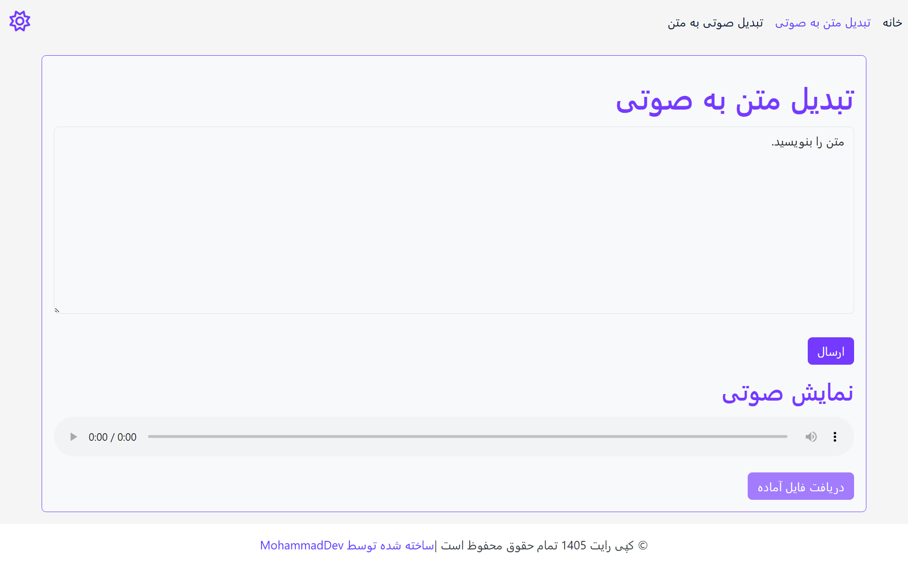
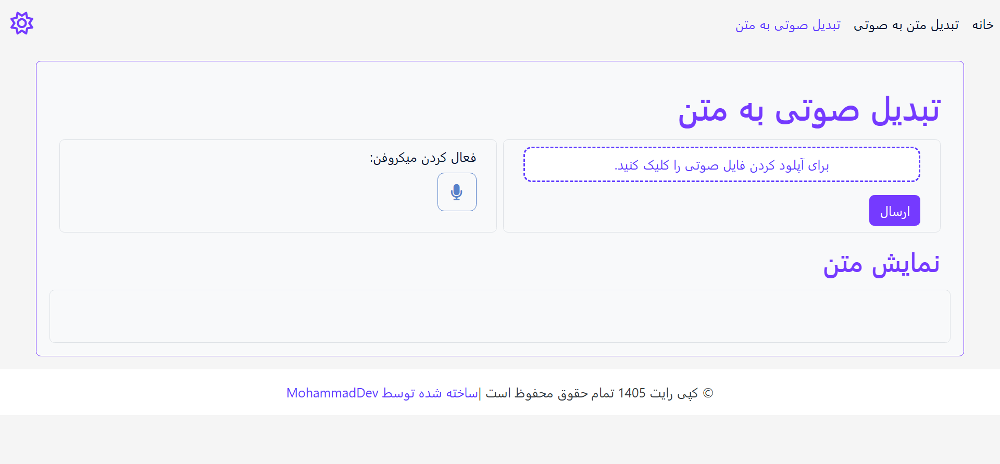

# VoiceText 🎙️

VoiceText is a full-stack Speech AI application that provides **Speech-to-Text (STT)** and **Text-to-Speech (TTS)** capabilities.

The project is built with a **FastAPI backend** and a **React frontend**, providing a modern web interface for interacting with speech processing models.

## Features

- 🎤 Speech-to-Text (STT) conversion
- 🔊 Text-to-Speech (TTS) generation
- 🇮🇷 Persian language speech support
- 📁 Audio file upload for speech recognition
- 🎙️ Real-time microphone recording
- 🌐 Single Page Application (SPA) architecture
- ⚡ FastAPI REST API backend
- ⚛️ React-based user interface

## Technologies
- Whisper (Speech-to-Text)
- Persian Text-to-Speech Model
- Deep Learning based Speech Processing
- PyTorch Model Checkpoints

### Backend
- Python
- FastAPI
- Pydantic
- REST API

### Frontend
- React
- Vite
- JavaScript
- SCSS
- Postcss

## AI Models

VoiceText uses deep learning models for speech processing:

### Text-to-Speech (TTS)
- Custom Persian TTS model
- Model checkpoint: `best_model_199921.pth`
- Configuration: `config.json`
- Converts Persian text into natural speech audio

### Speech-to-Text (STT)
- Whisper speech recognition model
- Model checkpoint: `small.pt`
- Converts speech audio into text

### AI / Speech Models
- Whisper (Speech Recognition)
- Persian TTS Models

## Screenshots
### Home Page

### TTS Page

### STT Page

